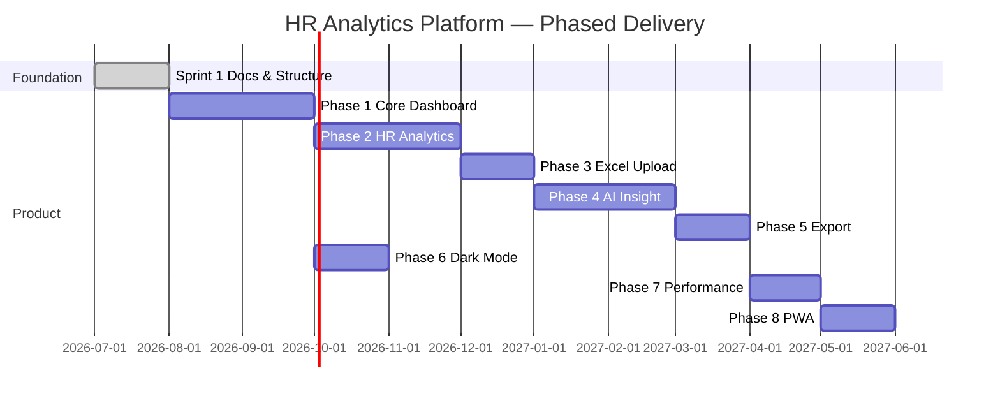

# Project Plan — HR New Hire Analytics Dashboard

This document defines phased delivery from foundation to a full HR Analytics Platform. Each phase has clear goals, deliverables, dependencies, and acceptance criteria.

---

## Overview

Phases 6 (Dark Mode) may run in parallel with Phases 3–5 once Phase 1 theming hooks exist.

---

## Sprint 1 — Project Foundation ✅

**Goal:** Establish repository structure, documentation, and engineering standards without application code.

**Deliverables:**

- `README.md`, `PROJECT_PLAN.md`, `PROJECT_STRUCTURE.md`, `CODING_GUIDELINES.md`
- `TODO.md`, `CHANGELOG.md`, `LICENSE`, `.gitignore`
- Empty directories: `assets/`, `css/`, `js/`, `data/`, `docs/`

**Acceptance criteria:**

- [x] All documentation files present and internally consistent
- [x] Folder structure matches `PROJECT_STRUCTURE.md`
- [x] No HTML/CSS/JS application code committed
- [x] GitHub Pages deployment path documented

---

## Phase 1 — Core Dashboard

**Goal:** Ship a usable dashboard shell that loads sample data and displays KPIs and primary charts.

**Scope:**

- `index.html` — semantic layout, skip links, landmark regions
- Design tokens (`css/tokens.css`) — color, spacing, typography
- App bootstrap (`js/main.js`, `js/app.js`)
- Data layer: load JSON from `data/sample-new-hires.json`
- KPI cards: total hires, avg time-to-hire, open roles, offer acceptance rate
- Chart.js: hires over time (line), hires by department (bar)
- Grid.js: sortable new-hire table with pagination
- Lucide icons for navigation and KPI affordances
- Responsive layout: mobile → tablet → desktop
- GitHub Pages deployment verified

**Dependencies:** Sprint 1 complete.

**Acceptance criteria:**

- Dashboard renders from static JSON without a backend
- All KPI values derive from loaded data (no hardcoded demo numbers)
- Table and charts update when dataset is swapped
- Lighthouse Accessibility score ≥ 90
- Works on Chrome, Firefox, Safari (latest)

**Out of scope:** Excel upload, AI, PDF export, dark mode, PWA.

---

## Phase 2 — HR Analytics

**Goal:** Deep analytics views beyond the overview dashboard.

**Scope:**

- Dedicated analytics routes/views (hash or lightweight router)
- Metrics: time-to-hire by department, source channel effectiveness, offer-to-start conversion
- Funnel visualization (applied → interviewed → offered → hired)
- Date range and department filters (client-side)
- Comparison periods (MoM, QoQ)
- Drill-down from chart segments to filtered table
- Analytics-specific aggregations in `js/services/analytics.js`

**Dependencies:** Phase 1 data model and chart infrastructure.

**Acceptance criteria:**

- Filters apply consistently across all analytics widgets
- Aggregations are unit-tested or validated against fixture datasets
- Empty and partial data states handled gracefully

---

## Phase 3 — Excel Upload

**Goal:** Allow HR users to import `.xlsx` / `.xls` files and replace or merge dashboard data.

**Scope:**

- SheetJS integration in `js/services/import.js`
- Drag-and-drop and file picker UI
- Column mapping UI (expected schema vs. uploaded headers)
- Validation: required fields, date formats, duplicate detection
- Error reporting with row-level messages
- Optional: persist last import in `localStorage` (size limits documented)
- Export validated JSON for offline reuse

**Dependencies:** Phase 1 data schema; Phase 2 filters should work on imported data.

**Acceptance criteria:**

- Sample template Excel downloadable from UI
- Invalid files show actionable errors without breaking the app
- Import of 5,000 rows completes in < 3s on mid-range hardware

---

## Phase 4 — AI Insight

**Goal:** Surface automated narrative insights and anomaly highlights from hire data.

**Scope:**

- Rule-based insight engine (Phase 4a) — no external API required for MVP
- Optional LLM integration hook (Phase 4b) — configurable endpoint, API key via env/build flag only
- Insight cards: trends, outliers, department comparisons
- “Explain this chart” contextual summaries
- Insight history and dismiss/snooze

**Dependencies:** Phases 1–2 aggregations; stable data schema from Phase 3.

**Acceptance criteria:**

- Insights regenerate when data or filters change
- No PII sent to external services without explicit user consent
- Graceful degradation when AI service unavailable

---

## Phase 5 — Export

**Goal:** Generate shareable reports for stakeholders.

**Scope:**

- html2canvas: capture dashboard regions and individual charts
- jsPDF: multi-page PDF with title, date range, and KPI summary
- Export presets: full dashboard, analytics only, table CSV
- Print stylesheet (`css/print.css`)
- Filename conventions and metadata footer

**Dependencies:** Phase 1 layout; Phase 2 filters reflected in export header.

**Acceptance criteria:**

- PDF matches on-screen data for current filter state
- Export works in Chrome and Firefox
- File size reasonable for email attachment (< 5 MB typical)

---

## Phase 6 — Dark Mode

**Goal:** Accessible dark theme with user preference persistence.

**Scope:**

- CSS custom properties for light/dark palettes
- Toggle in header; respect `prefers-color-scheme`
- Persist choice in `localStorage`
- Chart.js and Grid.js theme overrides
- Contrast validation (WCAG AA minimum)

**Dependencies:** Phase 1 design tokens.

**Acceptance criteria:**

- No flash of wrong theme on load
- All interactive elements meet contrast requirements in both themes

---

## Phase 7 — Performance

**Goal:** Optimize for large datasets and low-end devices.

**Scope:**

- Lazy load non-critical modules (dynamic `import()`)
- Debounced filter updates
- Web Worker for heavy aggregations (`js/workers/aggregate.js`)
- Virtual scrolling or Grid.js pagination tuning
- Asset minification strategy for vendor libs
- Performance budget documented in `docs/PERFORMANCE.md`

**Dependencies:** Phases 1–3 with realistic large fixtures in `data/`.

**Acceptance criteria:**

- 10,000-row dataset: initial interactive render < 2s
- Lighthouse Performance score ≥ 85 on mid-tier mobile emulation

---

## Phase 8 — PWA

**Goal:** Installable, offline-capable application shell.

**Scope:**

- `manifest.webmanifest` — icons, theme color, display mode
- Service worker — cache static assets and last-known data
- Offline fallback page
- Update prompt when new version deployed
- App icons in `assets/icons/`

**Dependencies:** Phase 7 asset strategy; GitHub Pages HTTPS.

**Acceptance criteria:**

- Installable on Chrome desktop and Android
- Core dashboard readable offline with cached sample data
- Service worker update does not corrupt user imports in localStorage

---

## Data Schema (Target)

Canonical new-hire record (Phase 1+):

| Field | Type | Required | Description |
|-------|------|----------|-------------|
| `id` | string | yes | Unique identifier |
| `fullName` | string | yes | Employee full name |
| `department` | string | yes | e.g. Engineering, Sales |
| `role` | string | yes | Job title |
| `hireDate` | ISO date | yes | Start date |
| `offerDate` | ISO date | no | Offer accepted date |
| `source` | string | no | Recruiting channel |
| `status` | enum | yes | `hired`, `pending`, `withdrawn` |

Schema versioning will live in `data/schema.json` (Phase 1).

---

## Risk Register

| Risk | Mitigation |
|------|------------|
| Large Excel files block main thread | Web Worker parsing in Phase 3/7 |
| GitHub Pages base path breaks assets | `<base>` tag and relative paths |
| Chart accessibility gaps | Table fallbacks and ARIA labels |
| Vendor lib size | Subset builds, lazy load in Phase 7 |

---

## Success Metrics

- HR team can answer “How many hires this quarter by department?” in < 30 seconds
- Zero backend hosting cost for MVP
- Codebase maintainable by a single frontend engineer without framework lock-in

---

## Document History

| Version | Date | Author | Notes |
|---------|------|--------|-------|
| 1.0.0 | 2026-07-27 | Project team | Initial plan including Sprint 1 |
