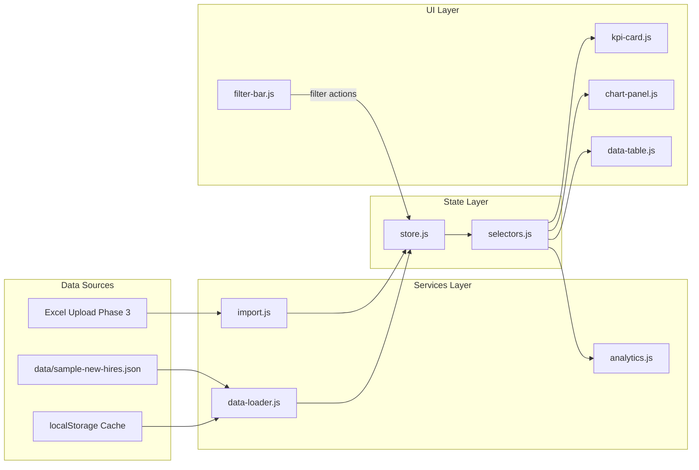

# Project Structure — HR New Hire Analytics Dashboard

This document describes the repository layout, planned JavaScript modules, CSS architecture, and data flow. It is the source of truth for where code and assets belong.

---

## Repository Tree

```
HR-NewHire-Dashboard/
│
├── assets/                      # Static binary and third-party assets
│   ├── fonts/                   # Self-hosted web fonts (Phase 1+)
│   ├── icons/                   # Favicon, PWA icons (Phase 8)
│   ├── images/                  # Logos, empty states, marketing
│   └── vendor/                  # Vendored minified libraries
│       ├── chart.js/
│       ├── gridjs/
│       ├── lucide/
│       ├── sheetjs/
│       ├── html2canvas/
│       └── jspdf/
│
├── css/                         # Stylesheets (no preprocessor)
│   ├── tokens.css               # Design tokens (custom properties)
│   ├── reset.css                # Minimal normalize / reset
│   ├── typography.css           # Type scale and font faces
│   ├── layout.css               # Grid, containers, page shell
│   ├── components/              # Reusable UI blocks
│   │   ├── button.css
│   │   ├── card.css
│   │   ├── chart-wrapper.css
│   │   ├── table.css
│   │   ├── modal.css
│   │   └── ...
│   ├── utilities.css            # Single-purpose helpers (spacing, visibility)
│   ├── themes/                  # Light / dark theme overrides (Phase 6)
│   │   ├── light.css
│   │   └── dark.css
│   ├── print.css                # Print and PDF layout (Phase 5)
│   └── main.css                 # Entry: @import order for all CSS
│
├── js/                          # Application logic (ES2022 modules)
│   ├── main.js                  # Entry point: DOMContentLoaded bootstrap
│   ├── app.js                   # App shell: init, routing, global state
│   ├── config.js                # Constants, feature flags, base paths
│   │
│   ├── state/                   # Client-side state management
│   │   ├── store.js             # Central store (pub/sub or lightweight proxy)
│   │   └── selectors.js         # Derived state (filtered rows, KPI values)
│   │
│   ├── services/                # Data and side-effect services
│   │   ├── data-loader.js       # Fetch JSON, normalize records
│   │   ├── analytics.js         # Aggregations, metrics (Phase 2)
│   │   ├── import.js            # Excel parse and validate (Phase 3)
│   │   ├── insights.js          # Rule-based / AI insights (Phase 4)
│   │   ├── export.js            # PDF / image / CSV export (Phase 5)
│   │   └── storage.js           # localStorage abstraction
│   │
│   ├── components/              # UI components (DOM factories or classes)
│   │   ├── header.js
│   │   ├── kpi-card.js
│   │   ├── chart-panel.js
│   │   ├── data-table.js
│   │   ├── filter-bar.js
│   │   ├── import-dialog.js
│   │   └── theme-toggle.js
│   │
│   ├── charts/                  # Chart.js configuration factories
│   │   ├── hires-over-time.js
│   │   ├── hires-by-department.js
│   │   ├── funnel.js
│   │   └── chart-theme.js       # Shared colors, fonts, a11y
│   │
│   ├── utils/                   # Pure helpers
│   │   ├── date.js
│   │   ├── format.js
│   │   ├── dom.js
│   │   └── validate.js
│   │
│   └── workers/                 # Web Workers (Phase 7)
│       └── aggregate.js
│
├── data/                        # Datasets and schema
│   ├── schema.json              # Record schema and version
│   ├── sample-new-hires.json    # Development / demo dataset
│   └── fixtures/                # Test fixtures for edge cases
│
├── docs/                        # Extended documentation
│   ├── ARCHITECTURE.md          # Deep-dive architecture (future)
│   ├── PERFORMANCE.md           # Budgets and profiling (Phase 7)
│   ├── screenshots/             # README and release screenshots
│   └── adr/                     # Architecture Decision Records
│
├── index.html                   # Single-page shell (Phase 1)
├── manifest.webmanifest         # PWA manifest (Phase 8)
├── sw.js                        # Service worker (Phase 8)
│
├── README.md
├── PROJECT_PLAN.md
├── PROJECT_STRUCTURE.md         # This file
├── CODING_GUIDELINES.md
├── TODO.md
├── CHANGELOG.md
├── LICENSE
└── .gitignore
```

> **Sprint 1:** Only top-level folders exist (`assets/`, `css/`, `js/`, `data/`, `docs/`). Subfolders and application files are created in subsequent phases as listed above.

---

## Folder Descriptions

### `assets/`

Static files that are not source code. Vendor libraries are copied here (not npm-linked in production) to keep GitHub Pages deployment simple and reproducible.

| Subfolder | Purpose |
|-----------|---------|
| `fonts/` | WOFF2 font files and `@font-face` companions |
| `icons/` | Favicon, apple-touch-icon, PWA maskable icons |
| `images/` | Branding, illustrations, empty-state graphics |
| `vendor/` | Third-party minified JS/CSS with versioned subfolders |

### `css/`

All styling uses native CSS. No Sass/Less. Component styles are split by concern for maintainability.

| File / folder | Purpose |
|---------------|---------|
| `tokens.css` | CSS custom properties: colors, spacing, radii, shadows, z-index scale |
| `reset.css` | Cross-browser baseline |
| `typography.css` | Font stacks, heading scale, line heights |
| `layout.css` | Page grid, sidebar, main content regions |
| `components/` | One file per UI component; BEM-like class naming |
| `utilities.css` | Opt-in helpers; avoid utility explosion |
| `themes/` | Theme-specific token overrides |
| `print.css` | Print media queries for export |
| `main.css` | Single entry imported by `index.html` |

### `js/`

ES2022 modules loaded via `<script type="module">`. No bundler required for MVP; Phase 7 may introduce optional minification.

| Area | Responsibility |
|------|----------------|
| `main.js` | Parse config, mount app, global error handler |
| `app.js` | Orchestrate views, wire services to components |
| `config.js` | Base URL, API endpoints (future), feature flags |
| `state/` | Single source of truth for records, filters, UI state |
| `services/` | I/O, parsing, analytics, export — no direct DOM |
| `components/` | Render and bind DOM; subscribe to store |
| `charts/` | Chart.js config builders; receive data, return chart instance |
| `utils/` | Pure functions; easy to reason about and test |
| `workers/` | CPU-heavy work off main thread |

### `data/`

JSON datasets and schema definitions. Never commit real employee PII — use synthetic sample data only.

| File | Purpose |
|------|---------|
| `schema.json` | Field definitions, types, enums, schema version |
| `sample-new-hires.json` | Default dataset for development and offline demo |
| `fixtures/` | Edge cases: empty departments, invalid dates, large volume |

### `docs/`

Human-readable documentation beyond root markdown files: architecture notes, ADRs, performance budgets, screenshot assets.

---

## JavaScript File Reference (Planned)

Each file has a single primary responsibility. Dependencies flow **downward**: `components` → `services` / `state` → `utils`. Nothing in `utils/` imports from `components/`.

| File | Phase | Description |
|------|-------|-------------|
| `main.js` | 1 | Entry: imports `app.js`, handles uncaught errors |
| `app.js` | 1 | Initializes store, loads data, mounts layout regions |
| `config.js` | 1 | `BASE_PATH`, `DATA_URL`, feature toggles |
| `state/store.js` | 1 | Holds `records`, `filters`, `ui`; emit change events |
| `state/selectors.js` | 1 | `getFilteredRecords()`, `getKpiMetrics()` |
| `services/data-loader.js` | 1 | `fetch()` JSON, validate against schema |
| `services/analytics.js` | 2 | Group-by, time-series, conversion rates |
| `services/import.js` | 3 | SheetJS read, map columns, merge/replace |
| `services/insights.js` | 4 | Generate insight objects from selectors |
| `services/export.js` | 5 | html2canvas + jsPDF pipeline |
| `services/storage.js` | 3 | Namespaced localStorage get/set/remove |
| `components/header.js` | 1 | Top bar, nav, theme toggle slot |
| `components/kpi-card.js` | 1 | Renders metric label, value, delta |
| `components/chart-panel.js` | 1 | Canvas host, loading/empty states |
| `components/data-table.js` | 1 | Grid.js wrapper |
| `components/filter-bar.js` | 2 | Date range, department multiselect |
| `components/import-dialog.js` | 3 | Upload UI and mapping wizard |
| `components/theme-toggle.js` | 6 | Light/dark switch |
| `charts/hires-over-time.js` | 1 | Line chart config |
| `charts/hires-by-department.js` | 1 | Bar chart config |
| `charts/funnel.js` | 2 | Funnel / bar stepped chart |
| `charts/chart-theme.js` | 1 | Shared Chart.js defaults |
| `utils/date.js` | 1 | Parse ISO dates, quarter boundaries |
| `utils/format.js` | 1 | Number, percent, date formatting |
| `utils/dom.js` | 1 | `createElement` helpers, event delegation |
| `utils/validate.js` | 3 | Row-level schema validation |
| `workers/aggregate.js` | 7 | Large dataset aggregation messages |

---

## CSS Architecture

### Layer order (in `main.css`)

1. **Tokens** — variables only, no element selectors
2. **Reset** — box-sizing, margin zeroing
3. **Typography** — `body`, headings, links
4. **Layout** — shell structure
5. **Components** — alphabetical import order within folder
6. **Utilities** — last, lowest specificity
7. **Themes** — override tokens on `[data-theme="dark"]`
8. **Print** — `@media print`

### Naming convention

Block__element--modifier (BEM-inspired):

```css
.kpi-card { }
.kpi-card__label { }
.kpi-card__value { }
.kpi-card--highlight { }
```

### Specificity rules

- Prefer class selectors; avoid `#id` for styling
- No `!important` except print utilities or third-party overrides
- Component files must not style global elements outside their block

### Responsive approach

Mobile-first breakpoints defined in `tokens.css`:

| Token | Min width |
|-------|-----------|
| `--bp-sm` | 640px |
| `--bp-md` | 768px |
| `--bp-lg` | 1024px |
| `--bp-xl` | 1280px |

---

## Data Flow



### Flow description

1. **Bootstrap:** `main.js` loads `config.js`, creates store, calls `data-loader.js`.
2. **Load:** JSON is fetched, validated against `data/schema.json`, normalized to canonical records.
3. **Store:** Records and default filters are written to `store.js`; subscribers notified.
4. **Select:** `selectors.js` derives filtered records and KPI metrics from store snapshot.
5. **Render:** Components read selectors output and update DOM / Chart.js / Grid.js instances.
6. **Interact:** User changes filters → store updates → selectors recompute → components re-render.
7. **Import (Phase 3):** Excel → `import.js` → validated records → store replace/merge.
8. **Export (Phase 5):** Current selector snapshot + DOM capture → `export.js` → PDF/download.

### State shape (target)

```javascript
{
  records: [],           // canonical new-hire objects
  filters: {
    dateRange: { start, end },
    departments: [],
    status: []
  },
  ui: {
    theme: 'light' | 'dark' | 'system',
    activeView: 'dashboard' | 'analytics',
    loading: boolean,
    error: string | null
  },
  meta: {
    schemaVersion: string,
    lastUpdated: ISO string,
    source: 'json' | 'excel' | 'cache'
  }
}
```

---

## GitHub Pages Considerations

- All asset paths use relative URLs or `config.BASE_PATH`
- ES modules require HTTPS or localhost (GitHub Pages provides HTTPS)
- Service worker scope is repository root (Phase 8)

---

## Document History

| Version | Date | Notes |
|---------|------|-------|
| 1.0.0 | 2026-07-27 | Initial structure for Sprint 1 |
